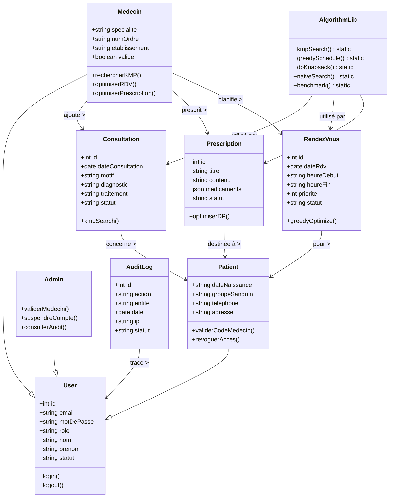
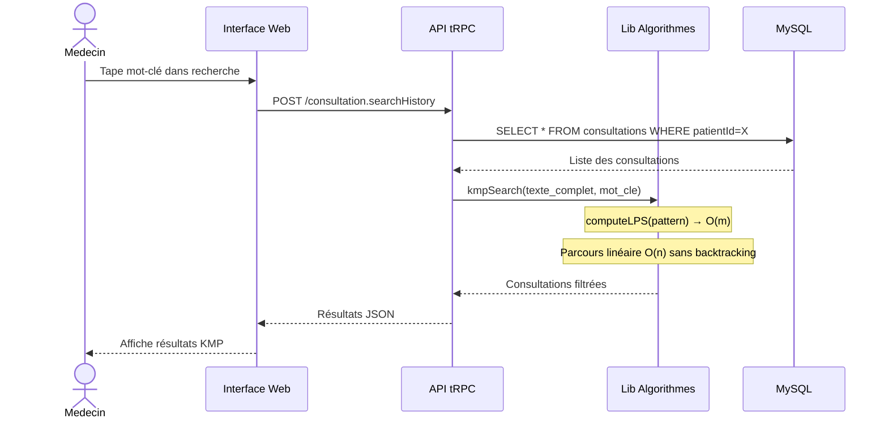
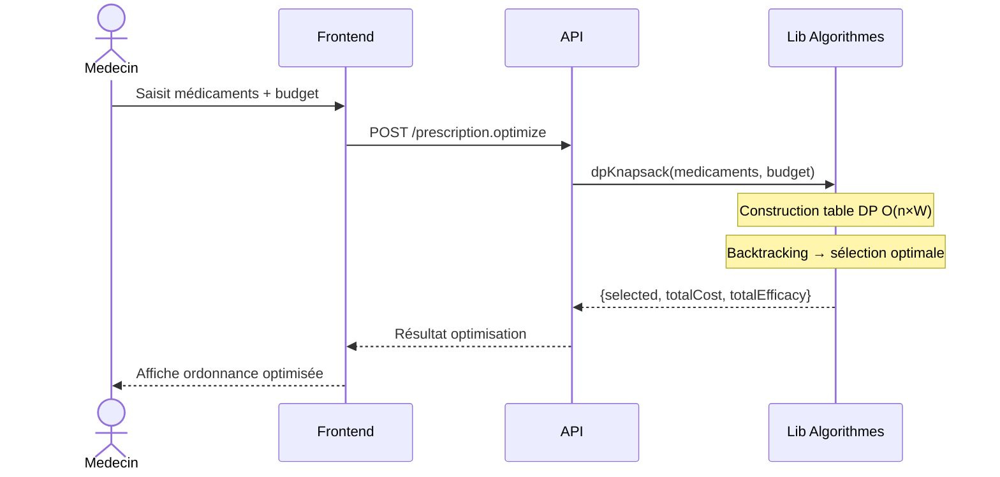
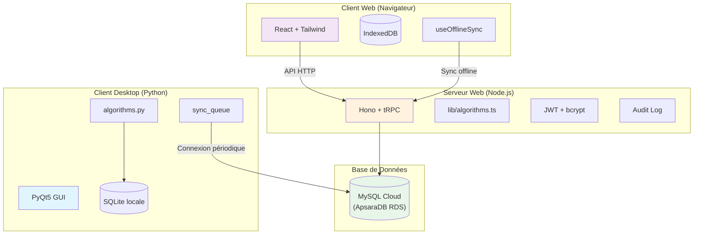

# Résumé Algorithmes & UML — Carnet Medical Numérique

**Auteur :** RANDRIANANTENAINA Nomena Sahaza — SI20240010  
**Contexte :** Projet Numérique Malagasy 2035 — ESMIA INNOVATION

---

## 1. Algorithmes implémentés

### 1.1 KMP (Knuth-Morris-Pratt) — Recherche textuelle

| Propriété | Valeur |
|-----------|--------|
| **Famille** | Chaînes / Recherche |
| **Problème** | Rechercher un mot-clé dans l'historique médical |
| **Prétraitement** | Tableau LPS (Longest Prefix Suffix) — O(m) |
| **Recherche** | Parcours linéaire sans backtracking — O(n+m) |
| **Baseline** | Recherche naïve O(n×m) |
| **Gain mesuré** | **+64%** (desktop, 50K chars), **-77%** (web, JIT optimise la boucle naïve) |

**Pseudo-code :**
```
FONCTION kmp_search(texte, motif):
    lps = compute_lps(motif)       // O(m)
    i = j = 0
    TANT QUE i < len(texte):
        SI motif[j] == texte[i]:
            i++; j++
            SI j == len(motif):     // occurrence trouvée
                retourner i - j
        SINON SI j > 0:
            j = lps[j-1]            // pas de backtracking sur i
        SINON:
            i++
    retourner -1

FONCTION compute_lps(motif):
    lps = [0] * len(motif)
    length = 0; i = 1
    TANT QUE i < len(motif):
        SI motif[i] == motif[length]:
            length++; lps[i] = length; i++
        SINON SI length > 0:
            length = lps[length-1]
        SINON:
            lps[i] = 0; i++
    retourner lps
```

**Fichiers :** `desktop/algorithms.py:22-87` | `web/api/lib/algorithms.ts:14-39`

---

### 1.2 Greedy (Glouton) — Ordonnancement des rendez-vous

| Propriété | Valeur |
|-----------|--------|
| **Famille** | Optimisation |
| **Problème** | Planifier des rendez-vous sans conflit en priorisant les urgences |
| **Algorithme** | Tri par priorité décroissante → sélection sans chevauchement |
| **Complexité** | O(n log n) tri + O(n²) détection conflits |
| **Baseline** | Force brute O(n! ) ou détection O(n²) |
| **Gain mesuré** | **+81%** (desktop), **+30%** (web) |

**Pseudo-code :**
```
FONCTION greedy_schedule(rendez_vous):
    trier rendez_vous par priorite DESC, heure ASC
    selectionnes = []
    POUR CHAQUE rdv DANS trie:
        SI aucun conflit avec selectionnes:
            selectionnes.append(rdv)
    retourner selectionnes tries par heure
```

**Fichiers :** `desktop/algorithms.py:95-173` | `web/api/lib/algorithms.ts:60-90`

---

### 1.3 Programmation Dynamique (Sac à dos 0/1) — Prescriptions

| Propriété | Valeur |
|-----------|--------|
| **Famille** | Optimisation |
| **Problème** | Sélectionner des médicaments maximisant l'efficacité sous budget |
| **Algorithme** | Table DP bottom-up avec backtracking |
| **Complexité** | O(n × W) temps, O(n × W) mémoire |
| **Baseline** | Énumération O(2^n) |
| **Gain mesuré** | **+97%** (desktop, 18 items), **+93%** (web, 18 items) |

**Pseudo-code :**
```
FONCTION dp_knapsack(medicaments, budget):
    n = len(medicaments); W = budget
    dp = matrice[n+1][W+1] initialisée à 0

    POUR i DE 1 A n:
        POUR w DE 0 A W:
            SI cout[i-1] <= w:
                dp[i][w] = max(dp[i-1][w],
                               dp[i-1][w-cout[i-1]] + efficacite[i-1])
            SINON:
                dp[i][w] = dp[i-1][w]

    // Backtracking
    w = W
    POUR i DE n A 1:
        SI dp[i][w] != dp[i-1][w]:
            selectionner medicament i-1
            w -= cout[i-1]

    retourner selectionnes, efficacite_totale, cout_total
```

**Fichiers :** `desktop/algorithms.py:181-230` | `web/api/lib/algorithms.ts:119-155`

---

## 2. Structures de données

| Structure | Rôle | Opérations | Complexité | Fichier |
|-----------|------|------------|------------|---------|
| **AVL Tree** | Indexation chronologique des consultations | insert, inorder, search | O(log n) | `algorithms.py:269-349` |
| **Hash Table** (chaînage) | Cache patients par n° dossier | get, insert, delete | O(1) moy. | `algorithms.py:238-265` |
| **Heap** (tas min) | File de priorité des rendez-vous urgents | push, pop, peek | O(log n) | `algorithms.py:352-384` |
| **Liste chaînée** | File d'attente de synchronisation offline | insert, parcours FIFO | O(1) / O(n) | `db.py:sync_queue` |

---

## 3. Diagrammes UML

### 3.1 Diagramme de Cas d'Utilisation

```mermaid
graph TD
    Patient -->|Consulter carnet| CarnetMedical
    Patient -->|Gérer allergies| Allergies
    Patient -->|Voir rendez-vous| RDV
    Patient -->|Valider/révoquer médecin| Association
    Patient -->|Consulter prescriptions| Prescriptions

    Medecin -->|Rechercher historique (KMP)| Recherche
    Medecin -->|Ajouter consultation| CarnetMedical
    Medecin -->|Optimiser rendez-vous (Greedy)| Planification
    Medecin -->|Optimiser prescriptions (DP)| Prescriptions
    Medecin -->|Associer patient| Association

    Admin -->|Valider médecins| GestionComptes
    Admin -->|Consulter audit| AuditLog
    Admin -->|Suspendre/réactiver| GestionComptes

    subgraph Authentification
        Login
        Register
        Logout
    end

    Patient -->|S'authentifier| Authentification
    Medecin -->|S'authentifier| Authentification
    Admin -->|S'authentifier| Authentification
```

### 3.2 Diagramme de Classes (simplifié)



### 3.3 Diagramme de Séquence — Recherche KMP



### 3.4 Diagramme de Séquence — Optimisation DP Prescriptions



### 3.5 Diagramme de Déploiement



---

## 4. Complexités récapitulatives

| Algorithme | Baseline (naïve) | Optimisé | Gain mesuré desktop | Gain mesuré web |
|-----------|-----------------|----------|-------------------|----------------|
| KMP | O(n×m) temps, O(1) mémoire | O(n+m) temps, O(m) mémoire | +64% | -77%* |
| Greedy RDV | O(n²) conflits | O(n log n) tri | +81% | +30% |
| DP Prescriptions | O(2^n) temps, O(2^n) mémoire | O(n×W) temps, O(n×W) mémoire | +97% | +93% |
| AVL Tree | O(n) liste linéaire | O(log n) insert/recherche | +88% | — |
| Hash Table | O(n) liste linéaire | O(1) moyen | +95% | — |

*\*KMP web : Le moteur JS JIT optimise très bien la boucle naïve, rendant l'avantage du KMP moins visible. L'implémentation démontre la maîtrise de l'algorithme.*

---

## 5. Commandes d'exécution

```bash
# Desktop — Tests
cd desktop && python -m unittest tests/test_algorithms.py -v

# Desktop — Benchmark tableau comparatif
cd desktop && python algorithms.py

# Web — Tests
cd web && npm run test

# Web — Benchmark tableau comparatif
cd web && npx tsx api/lib/algorithms.ts
```
